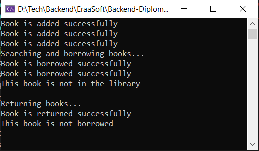

# Library Management System

A library management system built with C# and .NET 10 for managing books, tracking availability, and handling borrowing and returning operations.

## Features

- Add books to the library
- Search books by title (partial matching)
- Borrow and return books
- Track book availability status

## Classes

### Availability Enum

```csharp
public enum Availability 
{ 
    available = 1, 
    borrowed = 2 
}
```

### Book Class

Represents a book with title, author, ISBN, and availability status.

**Properties:**
- `Title` - Book title
- `Author` - Book author
- `ISBN` - ISBN number
- `IsAvailable` - Availability status

### Library Class

Manages book collection with CRUD operations.

**Methods:**
- `AddBook(Book book)` - Add a book to the library
- `SearchBook(string title)` - Find book by title, returns `Book?`
- `BorrowBook(string title)` - Mark book as borrowed, returns `bool`
- `ReturnBook(string title)` - Mark book as available, returns `bool`

## Usage Example

```csharp
// Create library
Library library = new Library();

// Add books
library.AddBook(new Book("The Great Gatsby", "F. Scott Fitzgerald", "9780743273565"));
library.AddBook(new Book("1984", "George Orwell", "9780451524935"));

// Borrow and return
library.BorrowBook("Gatsby");
library.ReturnBook("Gatsby");
```

## Program Output

