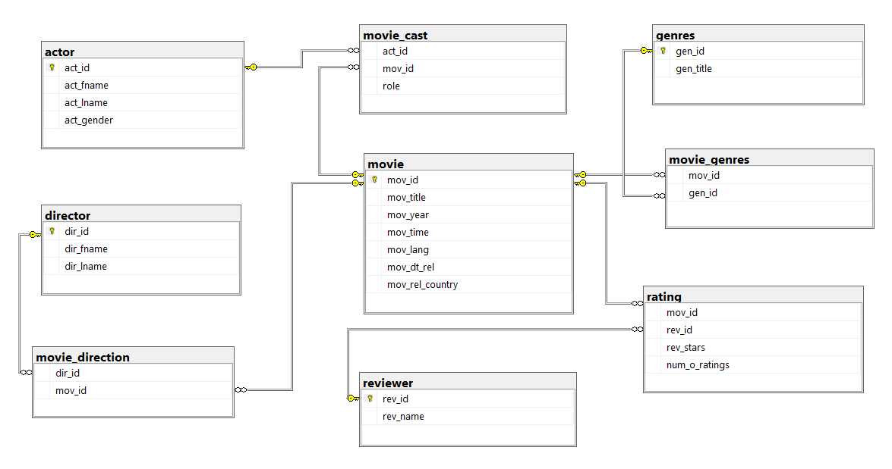

# DDL and DML Queries

## Overview

This task demonstrates the use of SQL DDL (Data Definition Language) and DML (Data Manipulation Language) queries for database schema creation, modification, and data manipulation.

## Files

### DDL.sql
This file contains DDL statements for creating and modifying database tables and constraints:
- Creating the `Employee` table with columns: id (int), name (varchar), salary (decimal)
- Altering table structures (adding/removing columns, changing data types)
- Creating the `Projects` table with primary key
- Adding primary key constraints to `Employee` table
- Establishing foreign key relationships between `Employee` and `Projects` tables

### DML.sql
This file contains DML SELECT queries for data retrieval from the `Employee` table:
- Basic SELECT statements (all columns, specific columns)
- DISTINCT queries
- TOP/LIMIT queries
- ORDER BY clauses
- OFFSET/FETCH for pagination
- Aggregate functions (AVG, MAX, MIN)

### MOCK_DATA.sql
This file contains INSERT statements to populate the `Employee` table with sample data:
- 50 sample employee records with id, name, department, projectId, and salary

### Movie.sql
This file contains DDL statements for creating a movie database schema:
- Database creation: `Movie`
- Tables: `actor`, `director`, `movie`, `reviewer`, `genres`
- Junction tables: `movie_direction`, `movie_cast` for many-to-many relationships
- Primary and foreign key constraints

- Movie Database
